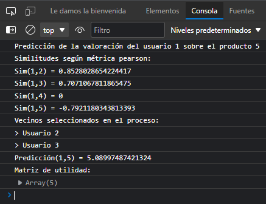

# Sistema Recomendación Filtrado Colaborativo
Simulación de un sistema de recomendación siguiendo el método de filtrado colaborativo.

Este sistema está implementado en una aplicación web, colgado en el siguiente enlace: https://tanafc.github.io/sistema-recomendacion-filtrado-colaborativo/

## Funcionamiento de la aplicación

La página principal contiene un formurio con los parámetros del recomendador a rellenar. En primer lugar, se debe adjuntar un fichero de texto con la matriz de utilidad a completar, con el siguiente formato:
```
5 3 4 4 -
3 1 2 3 3 
4 3 4 3 5
3 3 1 5 4
1 5 5 2 1
```
* En este ejemplo, cada fila representa las puntuaciones provistas por un usuario de diferentes ítems.
* El carácter '-' se emplea para indicar la puntuación del usuario que no es conocida del ítem, y la que se pretende calcular.

Para aplicar el método de filtrado colaborativo se necesita indicar el tipo de métrica a usar, de los que se puede elegir:
* Correlación de Pearson
* Distancia Coseno
* Distancia Euclídea

Además de indicar el tipo de predicción que se desea:
* Predicción simple
* Predicción con la media

Y por último, el número de vecinos a tener en cuenta dentro de la predicción, con un mínimo de 1 vecino.

Cuando se pulse el botón de calcular, la matriz se completará con los valores de puntuación predichos y se mostrará una caja con la matriz resultante, además de los parámetros seleccionados.


Si se desean observar los cálculos realizados por la aplicación, se pueden observar a través de la consola del navegador, que muestra:
* Las similitudes calculadas de los vecinos según la métrica empleada.
* Los vecinos seleccionados según la similitud y el número de vecinos a tener en cuenta.
* Las predicciones calculadas según el tipo de predicción indicado.
* La matriz resultado calculada.



## Código desarrollado

La aplicación se estructura en base al código del esqueleto HTML en el fichero `index.html`, los estilos dentro de la carpeta `styles`, y el código de javascript dentro de la carpeta de `scripts`.

La declaración de los elementos del DOM se realiza en el fichero de `index.js`, donde se recogen los valores de los inputs y se pasan a las funciones declaradas en `recommender.js`, que implementan los cálculos para el resultado de la matriz.

A destacar en este fichero es la función `recommendedMatrix`, la cual inicializa los valores del resultado a partir de los parámetros pasados de la matriz inicial, métrica a emplear, tipo de predicción y número de vecinos a considerar.

```js
export function recommendedMatrix(matrix, selectedMetric, selectedPrediction, numOfNeighbours) {
  let numUsers = matrix.length;
  let numItems = matrix[0].length;
  let rMatrix = matrix;
  let similitudes = [];
  let neighboursChosed = [];
  let predictions = [];
```

Esta función iterará por toda la matriz hasta encontrar un valor desconocido. Por cada puntuación, se buscarán aquellos vecinos adecuados para la predicción que tengan los mismos productos valorados y aquel que se pretende calcular. Una vez seleccionados, se calculan las similitudes mediante los métodos `calculatePearsonSimilarity`, `calculateEuclideanDistance` y `calculateCosineDistance`, dependiendo de la métrica escogida. 

```js
if (userValid) {
    // Calculamos la métrica correspondiente
    let sim;
    if (selectedMetric === 'pearson') {
    sim = calculatePearsonSimilarity(u, v, itemsReviewedOfUser, rMatrix);
    } else if (selectedMetric === 'euclidean') {
    sim = calculateEuclideanDistance(u, v, itemsReviewedOfUser, rMatrix);
    } else if (selectedMetric === 'cosine') {
    sim = calculateCosineDistance(u, v, itemsReviewedOfUser, rMatrix);
    } else {
    console.log("Error: metric not valid");
    }
    console.log(`Sim(${u + 1},${v + 1}) = ${sim}`);
    // Almacenamos las similitudes con los vecinos
    neighbours.push({
    user: v,
    sim: sim
    });
```

Una vez obtenidas las similitudes se escoge el número determinado de vecinos con mayor similitud al usuario.

```js
// Calculamos los vecinos más cercanos para la predicción
    let closestNeighbours = [];
    for (let it = 0; it < numOfNeighbours; it++) {
        let max = -1;
        let nCloser = 0;
        let chosed = false;
        for (let n = 0; n < neighbours.length; n++) {
        if (neighbours[n].sim >= max) {
            max = neighbours[n].sim;
            nCloser = n;
            chosed = true;
        }
        }
        if (chosed) {
        closestNeighbours.push(neighbours[nCloser]);
        neighbours.splice(nCloser, 1);
        }
    }
```

Mediante las funciones `calculateMeanDiffPrediction` y `calculateSimplePrediction` se calcula el tipo de predicción escogida.

```js
// Calculamos la predicción
let prediction = -1;
if (selectedPrediction === 'mean') {
    prediction = calculateMeanDiffPrediction(u, closestNeighbours, i, itemsReviewedOfUser, rMatrix);
} else if (selectedPrediction === 'simple') {
    prediction = calculateSimplePrediction(closestNeighbours, i, rMatrix);
} else {
    console.log('Error: prediction not valid');
}
```

Por último, se añaden los valores calculados a la matriz resultado redondeando el valor a dos decimales.

```js
rMatrix[u][i] = Math.round((prediction + Number.EPSILON) * 100) / 100;
```

Una vez calculada la matriz, en `index.js` se construirá dinámicamente la tabla que permitirá visualizar el resultado de la misma.

```js
// Mostramos la matriz de utilidad
let tbl = document.createElement('table');
for (let i = 0; i < rMatrix.length; i++) {
const tr = tbl.insertRow();
for (let j = 0; j < rMatrix[0].length; j++) {
    const td = tr.insertCell();
    td.appendChild(document.createTextNode(rMatrix[i][j]));
}
}
outputResults.appendChild(tbl);
```

## Autores
* Tanausú Falcón Casanova - alu0101320878@ull.edu.es


